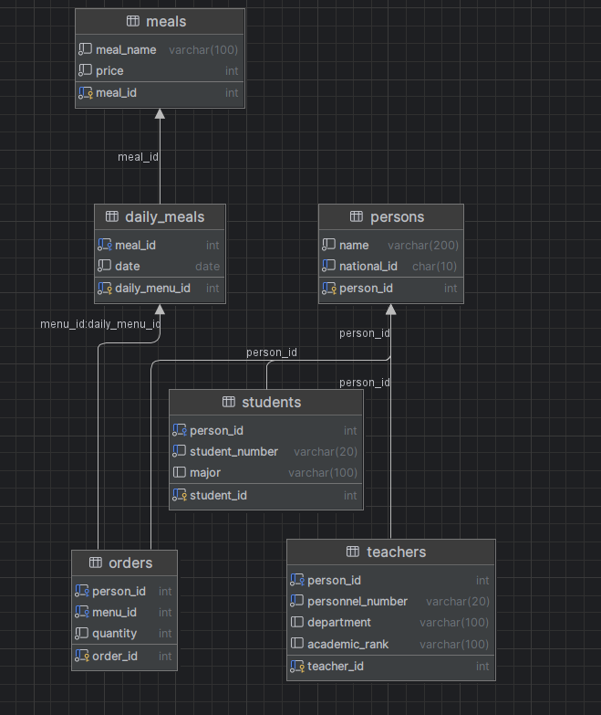

# سامانه سفارش غذای دانشگاهی – طراحی پایگاه داده

این پروژه شامل طراحی و پیاده‌سازی یک پایگاه داده رابطه‌ای برای **سامانه سفارش غذای دانشگاهی** است. این سیستم به‌گونه‌ای طراحی شده که اطلاعات مربوط به دانشجوها، اساتید، منوی غذاهای روزانه و سفارشات را مدیریت کند.

---

## ویژگی‌های پروژه

- ثبت‌نام کاربران شامل **دانشجو**، **استاد** یا **هردو**.
- ثبت منوی غذاهای هر روز توسط **مسئول سلف**.
- امکان **سفارش غذا** توسط کاربران در هر روز مشخص.
- مدیریت اطلاعات مرتبط با **غذاها، قیمت‌ها و تعداد سفارش‌ها**.

---

## ساختار پایگاه داده

### جداول

#### 1. جدول `persons`
ذخیره اطلاعات اولیه همه افراد (چه استاد و چه دانشجو).

- (کلید اصلی) `person_id` 
- (نام) `name`
- (کد ملی یکتا) `national_id`

  

#### 2. جدول `students`
اطلاعات مربوط به دانشجویان.

- (کلید اصلی) `student_id` 
- (کلید خارجی به جدول `persons`) `person_id` 
- (شماره دانشجویی یکتا) `student_number` 
- (رشته تحصیلی)`major`

  
#### 3. جدول `teachers`
اطلاعات مربوط به اساتید.
- (کلید اصلی)`teacher_id` 
- (کلید خارجی به جدول `persons`)`person_id` 
- (شماره پرسنلی یکتا)`personnel_number` 
- (دپارتمان) `department` 
- (مرتبه علمی) `academic_rank`

  
#### 4. جدول `meals`
لیست غذاهای موجود.
- (کلید اصلی) `meal_id` 
- (نام غذا)`meal_name` 
- (قیمت غذا) `price`
  

#### 5. جدول `daily_meals`
نقشه‌ای از غذاها به روزهای خاص.
- (کلید اصلی) `daily_menu_id` 
- (کلید خارجی به جدول `meals`)`meal_id` 
- (تاریخ) `date`
  

#### 6. جدول `orders`
ثبت سفارش‌های کاربران.
- (کلید اصلی) `order_id` 
- (کلید خارجی به جدول `persons`)`person_id` 
- (کلید خارجی به جدول `daily_meals`) `menu_id` 
- (تعداد سفارش) `quantity` 

---

## اسکریپت‌های SQL موجود

#### 1. `create_tables.sql`
تعریف کامل ساختار جداول و محدودیت‌ها.

#### 2. `insert_data.sql`
وارد کردن داده‌های نمونه جهت تست سیستم.

#### 3. `drop_tables.sql`
حذف جداول به ترتیب وابستگی‌ها.

---
## دیاگرام پایگاه داده

